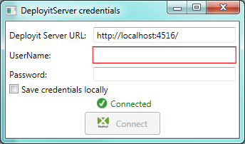
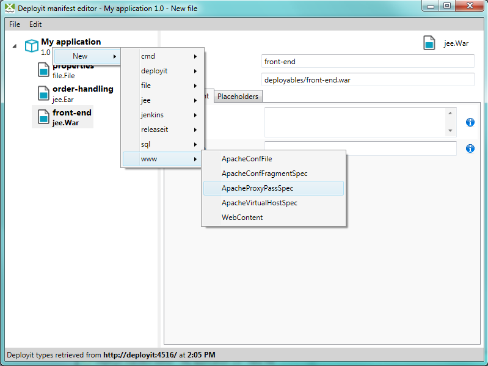

## Preface ##

This document describes the **XL Deploy Manifest Editor** auxiliary program, which helps you in putting together a valid `deployit-manifest.xml` file.

For more information about the XL Deploy manifest format, see the **[XL Deploy Packaging Manual](http://docs.xebialabs.com/releases/latest/deployit/packagingmanual.html)**. For general information about XL Deploy and CI types, see the **[XL Deploy Reference Manual](http://docs.xebialabs.com/releases/latest/deployit/referencemanual.html)**.

## Requirements ##

The XL Deploy Manifest Editor is a desktop application written in .NET 4.5, so it should work out-of-the box in Windows environments that have this version installed. Other environments need to use an emulator that supports WPF (Windows Presentation Foundation) applications.

## Features ##

* Connect to an XL Deploy instance to retrieve available types
* Start a new manifest or open and edit an existing one

The Manifest Editor deals with the `deployit-manifest.xml` manifest format only; the deprecated `MANIFEST.MF` format is not supported.

## Retrieving XL Deploy types ##

To produce a manifest that XL Deploy understands, and to be able to use all CI types XL Deploy knows about, the Manifest Editor will on startup ask where it can find XL Deploy, and what credentials to use. Note that the XL Deploy server URL must start with `http://` or `https://`. Credentials can optionally be saved (encrypted, under your personal local account) so it need not ask on subsequent runs. The XL Deploy Manifest Editor will not be able to connect to the XL Deploy server when it is running on https with untrusted (that is, non-registered, self-signed) certificates.

If you have more XL Deploy instances running, with different plugins or extensions, you can always force a new retrieval of CI types by choosing **File** -> **Connect to Deployit**.

## Putting together a manifest ##

Once a connection to a XL Deploy has been made, a new, empty, manifest will be opened. If you want to open an existing manifest, go to **File** -> **Open** and select the manifest you want. Vice versa, while working on a manifest, if you want to start a new one, choose **File** -> **New** manifest. *Do not* forget to save first!

The Manifest Editor screen is split into two parts: a tree-view on the left, listing all the CIs to be included in the manifest, and an, initially empty, right side where you fill in the details of each CI you want to configure.

The empty manifest is created for an application called My Application, version 1.0, as indicated on the left side of the screen. Click the label, and on the right-hand side you can now fill out the proper application name and version.

Note the red stars next to the text box labels: these indicate that a value is required. The Manifest Editor will happily let you save invalid manifests (so you need not complete it in its entirety before closing it) but it will issue warnings if you try to do so. Moreover, while the Manifest Editor will likely be able to read it back properly, we do not test for this situation; nor will XL Deploy be able to accept such a manifest, so use this with care.

To add CIs to your manifest, you can either use the **Edit** menu, or right-click the manifest label in the left-hand tree view. Under **New** you can find each CI type that you can add, subdivided by prefix, just as you are used to from the regular XL Deploy UI.

If you select a CI type, it will appear in the tree view, and the corresponding details form will be opened automatically. Give the newly added CI a proper name, and, if it is an artifact, a location. The location of an artifact should be entered not as the path to the file on your machine (so no `C:\\Users\\johndoe\\Documents\\artifact.png`) but as a relative path, as it is to be found inside the DAR that the manifest is going to be part of (i.e. e.g. `resources/images/artifact.png`). This is only a manifest editor after all, not a packager.

Also note that the manifest refers to deploy**ables** not deploy**eds**. While deployeds generally define many required properties, it is relatively rare to find them on deployables. (A notable example would be the Order property of the cmd.Command from the Command plugin) Since, again, this is a Manifest Editor not a packager, it is allowed to use placeholders; the XL Deploy engine will replace them with the correct values taken from its dictionaries in the usual way.

In order to remove a CI, again use the Edit menu or right-click the item in the tree view, and choose **Remove CI**.

Finally, to save the fruits of your labour, go to **File** -> **Save** to save the file. Finally, **File** -> **Quit** lets you exit the application gracefully, but not before giving you a chance to save your work.

## Creating a distribution ##
Use './gradlew clean build' will create a new distribution for manifest editor in build/distributions directory  
